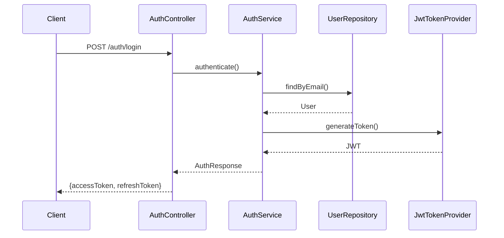
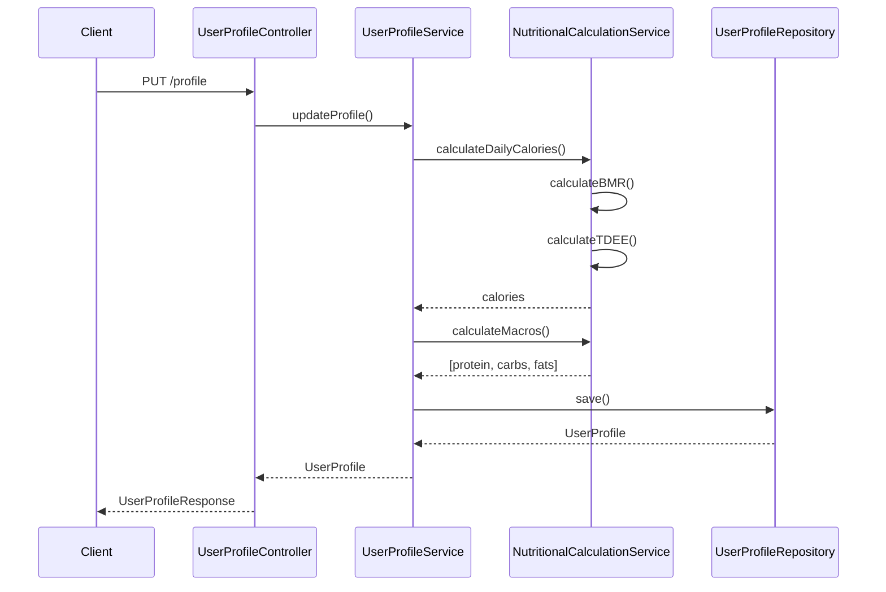

# Arquitectura del Sistema

## Visión General

Nutrition Tracker API sigue una arquitectura modular basada en Spring Boot con separación clara de responsabilidades.

## Patrones de Diseño

### 1. Arquitectura en Capas

```
┌─────────────────────────────────────┐
│         Controllers (API)           │  ← REST endpoints
├─────────────────────────────────────┤
│         Services (Lógica)           │  ← Business logic
├─────────────────────────────────────┤
│      Repositories (Datos)           │  ← Data access
├─────────────────────────────────────┤
│         Entities (Modelo)           │  ← Domain model
└─────────────────────────────────────┘
```

### 2. Módulos

El proyecto está organizado en módulos funcionales:

#### **auth** - Autenticación y Usuarios
- Gestión de usuarios y perfiles
- Autenticación JWT
- Cálculos nutricionales
- Objetivos personalizados

**Componentes clave:**
- `AuthController`: Login, registro, refresh token
- `UserProfileController`: Gestión de perfil
- `AuthService`: Lógica de autenticación
- `UserProfileService`: Gestión de perfiles
- `NutritionalCalculationService`: Cálculos TMB/TDEE/macros
- `JwtTokenProvider`: Generación y validación de tokens

#### **food** - Gestión de Alimentos
- CRUD de alimentos personalizados
- Búsqueda y filtrado
- Información nutricional completa

**Componentes clave:**
- `FoodController`: Endpoints de alimentos
- `FoodService`: Lógica de negocio
- `FoodRepository`: Acceso a datos

#### **dailylog** - Registro Diario
- Logs diarios por usuario
- Entradas por tipo de comida
- Cálculo de totales

**Componentes clave:**
- `DailyLogController`: Gestión de logs
- `DailyLogService`: Lógica de agregación
- `MealEntryService`: Gestión de entradas

#### **external** - APIs Externas
- Integración con OpenFoodFacts
- Búsqueda de productos
- Importación de alimentos

**Componentes clave:**
- `OpenFoodFactsClient`: Cliente HTTP
- `OpenFoodFactsService`: Transformación de datos
- `ExternalFoodController`: Endpoints de búsqueda

## Flujo de Datos

### Autenticación



### Cálculo de Objetivos



## Seguridad

### JWT Authentication Flow

1. Usuario se autentica con email/password
2. Backend genera access token (15 min) y refresh token (7 días)
3. Cliente incluye access token en header: `Authorization: Bearer <token>`
4. `JwtAuthenticationFilter` valida token en cada request
5. Si token expira, cliente usa refresh token para obtener nuevo access token

### Endpoints Públicos

- `/api/v1/auth/**` - Autenticación
- `/swagger-ui/**` - Documentación
- `/v3/api-docs/**` - OpenAPI spec
- `/actuator/health` - Health check

### Endpoints Protegidos

Todos los demás endpoints requieren JWT válido.

## Base de Datos

### Estrategia de Migraciones

- **Flyway** para control de versiones de schema
- Migraciones en `src/main/resources/db/migration`
- Naming: `V{version}__{description}.sql`
- Nunca modificar migraciones aplicadas

### Auditoría

Todas las entidades principales incluyen:
- `createdAt`: Timestamp de creación
- `updatedAt`: Timestamp de última modificación
- Gestionado automáticamente por JPA Auditing

## Configuración

### Perfiles

- **dev**: Desarrollo local (application-dev.yml)
- **prod**: Producción (application-prod.yml)
- **test**: Testing (application-test.yml)

### Propiedades Clave

```yaml
spring:
  datasource:
    url: jdbc:postgresql://localhost:5432/nutrition_tracker_db
  jpa:
    hibernate:
      ddl-auto: validate  # Flyway maneja el schema
    
jwt:
  secret: ${JWT_SECRET}
  access-token-expiration: 900000    # 15 min
  refresh-token-expiration: 604800000 # 7 días

external:
  openfoodfacts:
    base-url: https://world.openfoodfacts.org/api/v2
    timeout: 5000
```

## Manejo de Errores

### Global Exception Handler

`GlobalExceptionHandler` captura y formatea errores:

```java
@ExceptionHandler(ResourceNotFoundException.class)
public ResponseEntity<ErrorResponse> handleNotFound(ResourceNotFoundException ex) {
    return ResponseEntity
        .status(HttpStatus.NOT_FOUND)
        .body(new ErrorResponse(ex.getMessage()));
}
```

### Códigos de Error Comunes

- `400` - Bad Request (validación fallida)
- `401` - Unauthorized (token inválido/expirado)
- `403` - Forbidden (sin permisos)
- `404` - Not Found (recurso no existe)
- `500` - Internal Server Error

## Logging

### Niveles

- `ERROR`: Errores críticos
- `WARN`: Advertencias
- `INFO`: Información general
- `DEBUG`: Debugging detallado

### Configuración

```yaml
logging:
  level:
    com.nutritiontracker: DEBUG
    org.springframework.security: DEBUG
    org.hibernate.SQL: DEBUG
```

## Performance

### Caching

- Spring Cache para datos frecuentes
- TTL configurable por tipo de dato

### Paginación

Todos los endpoints de listado soportan paginación:

```
GET /api/v1/foods?page=0&size=20&sort=name,asc
```

### Optimizaciones

- Lazy loading de relaciones JPA
- Índices en columnas frecuentemente consultadas
- Connection pooling (HikariCP)

## Testing

### Estructura

```
src/test/java/
├── unit/           # Tests unitarios
├── integration/    # Tests de integración
└── e2e/           # Tests end-to-end
```

### Convenciones

- Usar `@SpringBootTest` para integration tests
- Usar `@WebMvcTest` para controller tests
- Usar `@DataJpaTest` para repository tests
- Mockear dependencias externas

## Deployment

### Build

```bash
mvn clean package
```

Genera: `target/nutrition-tracker-api-1.0.0.jar`

### Docker

```dockerfile
FROM openjdk:17-jdk-slim
COPY target/*.jar app.jar
ENTRYPOINT ["java","-jar","/app.jar"]
```

### Variables de Entorno

```bash
SPRING_PROFILES_ACTIVE=prod
DATABASE_URL=jdbc:postgresql://...
JWT_SECRET=...
```
